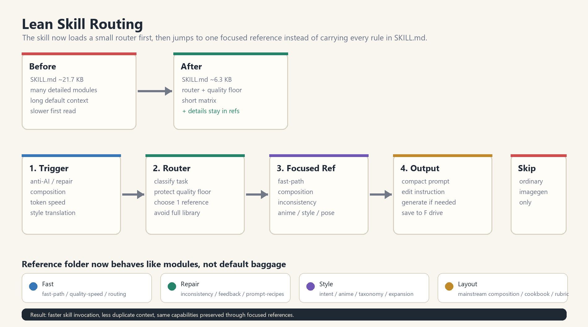
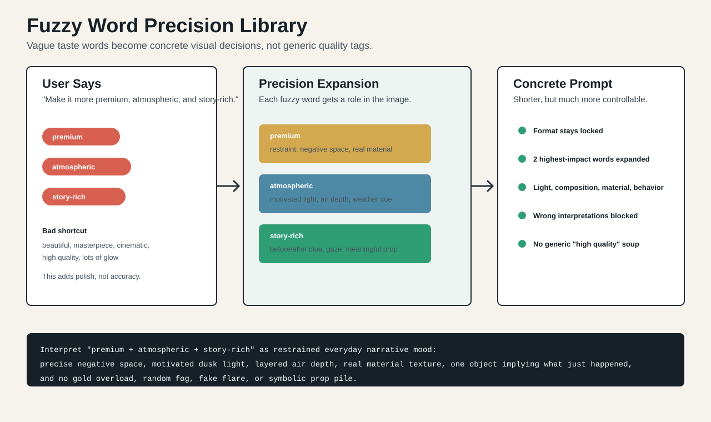
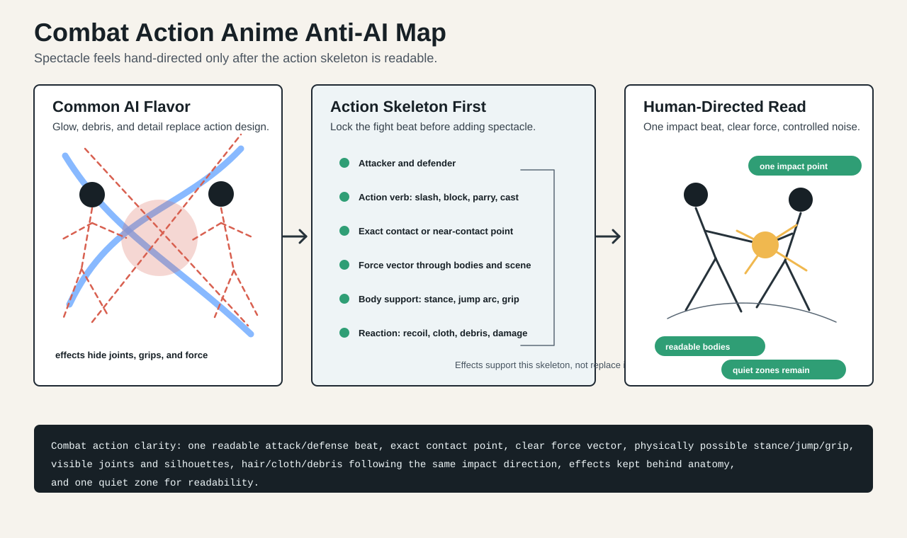
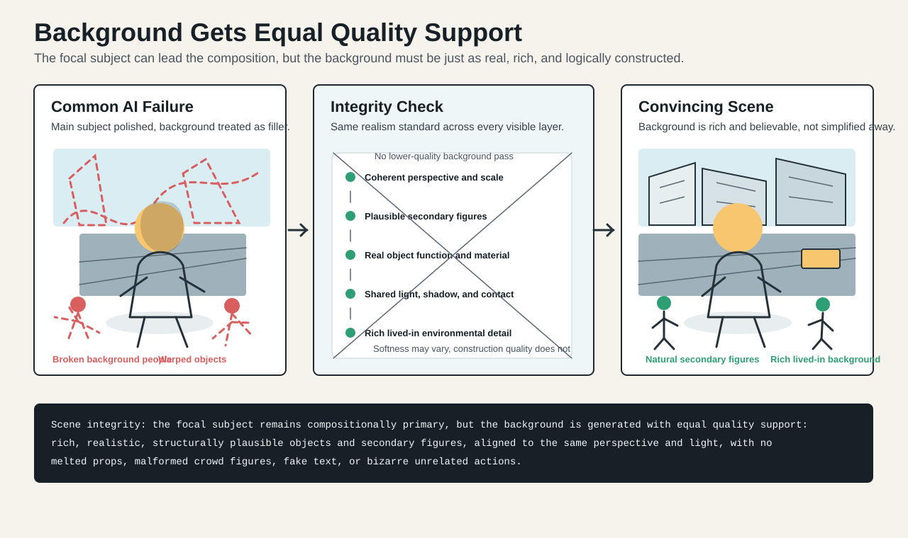
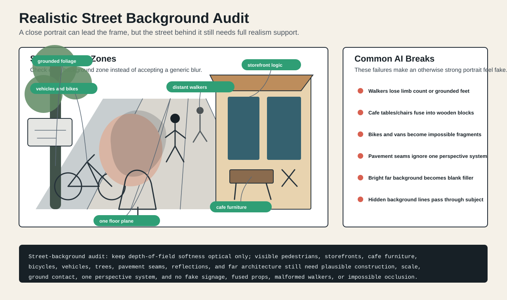
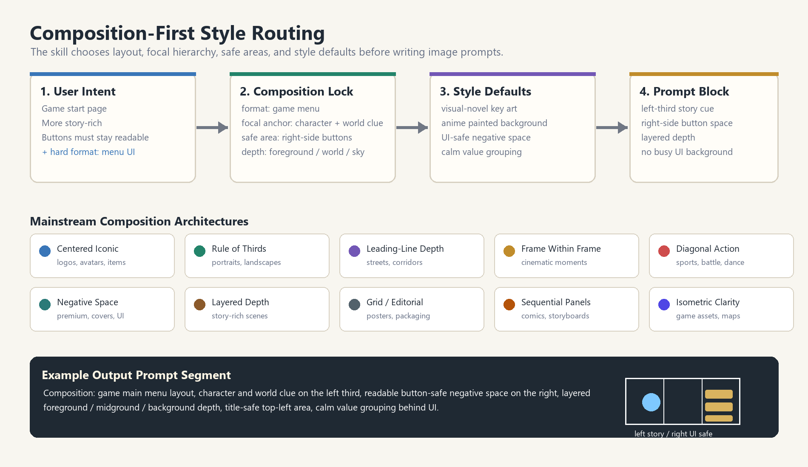
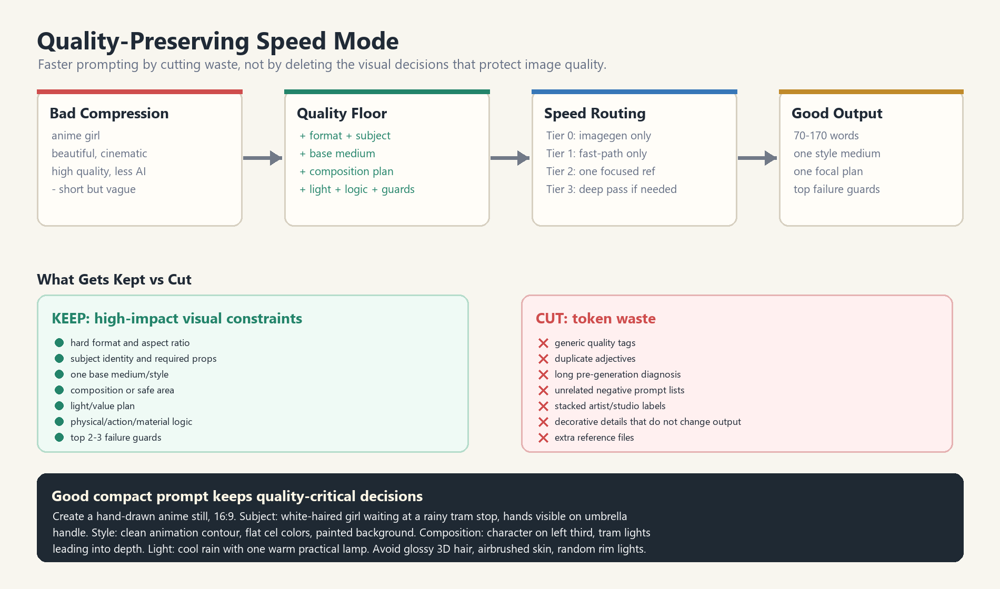

# image2-helper

一个可部署的 Codex 生图质量增强 Skill 项目。它的主目标是让每一次生图在生成前先完成提示词质量预检：补全意图、锁定格式、强化构图、透视、光影、动作、背景、物品、风格和一致性。降低“AI 感”只是其中一个质量模块，而不是项目唯一目的。

本仓库包含可直接安装的 skill：

```text
reduce-ai-look-imagegen/
```

文件夹名保留 `reduce-ai-look-imagegen` 是为了兼容已经安装和调用的旧版本；当前项目定位已经升级为 **Imagegen Preflight Quality Controller / 生图前置质量控制器**。

它适合处理这类需求：

- “帮我生成一张图，但先把提示词质量补完整”
- “提高这张图的构图、透视、光影、背景和动作质量”
- “保持格式/画幅/角色/背景不变，只优化生图质量”
- “把模糊的审美词转成真正可执行的生图语言”
- “二次元人物融入现实照片，背景不能有任何变化”
- “降低 AI 感”
- “不要这么假 / 油 / 塑料 / 像 3D”
- “动作、手、姿势不自然，帮我修”
- “我说高级感、氛围感、故事感，你帮我转成真正可用的生图提示词”
- “我要四格漫画，不要被生成成单张海报”
- “帮我判断这张图为什么像 AI”

如果用户只是普通地说“帮我生成一张图”，这个 skill 也会作为轻量前置质量控制层先运行，再把增强后的提示词交给普通生图工具。

## 它能解决什么

| 用户问题 | Skill 会做什么 |
|---|---|
| 普通生图描述太短 | 自动补齐格式、主体、构图、光影、透视、物理接触、背景质量和失败规避 |
| 只说“高级感 / 氛围感 / 故事感” | 转换成颜色、光线、材质、空间、叙事线索 |
| 模糊词堆叠导致 AI 乱猜 | 用模糊词准确化库把词拆成视觉功能、光色、构图、材质、行为和避错项 |
| 输出格式很重要 | 锁定四格漫画、LOGO、图标、海报、游戏菜单、角色设定、包装等格式 |
| 画面透视、比例、接触关系容易崩 | 锁定相机高度、地平线、消失点、地面/桌面平面、尺度参照、遮挡和接触阴影 |
| 手、动作、人体不合理 | 检查关节范围、重心、接触点、衣服和头发是否符合重力 |
| 打斗图华丽但像 AI | 先锁定攻击/防守关系、接触点、力的方向、身体支撑和动作可读性，再加特效 |
| 第一版图多了不该有的物品 | 去除多余法杖、武器、翅膀、光环、宠物、假文字等设定外元素 |
| 表情、行为、视角、环境不匹配 | 对齐表情和动作、视线和目标、镜头和环境透视 |
| 主角好看但背景糊弄、扭曲或假 | 背景与主角享有同等质量标准，检查次要人物、物品、建筑、透视、光影和动作逻辑 |
| 构图弱、画面散、不像专业图 | 先确定画幅、焦点、视觉路径、留白、安全区和前中后景 |
| 二次元角色融入现实照片 | 锁定原背景底板不变，只让角色适配背景的透视、光影、噪点、边缘、接触和遮挡 |
| 图片太像 AI | 把空泛词改成具体的媒介、材质、光影、构图语言 |
| 动漫图太油、太 3D | 转换成手绘动画、赛璐璐、线稿、色块、背景绘制语言 |
| 多种画风混在一起 | 避免“风格汤”，先确定主媒介，再加一个修饰风格 |
| token 消耗太高 / 想让 AI 思考更快 | 保质提速：删掉废话和重复标签，保留决定画面质量的关键约束 |

## 安装方法

### 最简单：复制这段提示词给 Codex

把下面这段直接复制到 Codex 里，让 Codex 自动帮你安装：

```text
请帮我安装这个 Codex skill：https://github.com/ylty1516/image2-helper

要求：
1. 克隆或下载这个仓库。
2. 把仓库里的 reduce-ai-look-imagegen 文件夹复制到我的 Codex skills 目录：
   - Windows: C:\Users\我的用户名\.codex\skills\reduce-ai-look-imagegen
   - macOS/Linux: ~/.codex/skills/reduce-ai-look-imagegen
3. 确认最终存在 SKILL.md：
   reduce-ai-look-imagegen/SKILL.md
4. 安装完成后告诉我是否成功。
5. 不要修改 skill 内容。
```

短版：

```text
请从 https://github.com/ylty1516/image2-helper 安装 Codex skill。把 reduce-ai-look-imagegen 文件夹复制到我的 ~/.codex/skills/ 目录下，确保最终路径是 ~/.codex/skills/reduce-ai-look-imagegen/SKILL.md。安装后告诉我结果。
```

### 方法一：用 Git 安装

打开 PowerShell，运行：

```powershell
git clone https://github.com/ylty1516/image2-helper.git
Copy-Item -Recurse .\image2-helper\reduce-ai-look-imagegen "$env:USERPROFILE\.codex\skills\reduce-ai-look-imagegen"
```

然后重启 Codex，或者新开一个 Codex 对话线程。

### 方法二：下载 ZIP 安装

1. 打开仓库页面：<https://github.com/ylty1516/image2-helper>
2. 点击绿色的 `Code` 按钮。
3. 点击 `Download ZIP`。
4. 解压下载好的压缩包。
5. 找到里面的 `reduce-ai-look-imagegen` 文件夹。
6. 把整个 `reduce-ai-look-imagegen` 文件夹复制到你的 Codex skills 目录。

Windows 用户最终路径应该像这样：

```text
C:\Users\你的用户名\.codex\skills\reduce-ai-look-imagegen\SKILL.md
```

macOS / Linux 用户最终路径应该像这样：

```text
~/.codex/skills/reduce-ai-look-imagegen/SKILL.md
```

### Windows 一行安装命令

如果你已经克隆或解压了本仓库，并且当前终端就在仓库根目录，运行：

```powershell
Copy-Item -Recurse .\reduce-ai-look-imagegen "$env:USERPROFILE\.codex\skills\reduce-ai-look-imagegen"
```

### macOS / Linux 一行安装命令

如果你已经克隆或解压了本仓库，并且当前终端就在仓库根目录，运行：

```bash
mkdir -p ~/.codex/skills
cp -R ./reduce-ai-look-imagegen ~/.codex/skills/reduce-ai-look-imagegen
```

### 如何确认安装成功

确认这个文件存在：

```text
Windows:
C:\Users\你的用户名\.codex\skills\reduce-ai-look-imagegen\SKILL.md

macOS / Linux:
~/.codex/skills/reduce-ai-look-imagegen/SKILL.md
```

然后重启 Codex，或新开一个线程，输入：

```text
Use $reduce-ai-look-imagegen to preflight this image prompt before generation: a glossy anime character poster, cinematic, high quality
```

如果 Codex 能识别 `$reduce-ai-look-imagegen`，说明安装成功。

## 快速使用

当你想提升生图质量时，可以这样说：

```text
Use $reduce-ai-look-imagegen 帮我做生图前置质量增强：
一个白发动漫少女站在城市街道上，cinematic，高质量
```

它会优先补齐真正影响画面的质量约束：

```text
Format: portrait illustration, vertical crop.
Subject: white-haired anime girl standing on a city street.
Composition: clear focal anchor, readable silhouette, layered foreground/midground/background.
Light/color: one motivated street light and ambient city fill, controlled highlights.
Perspective: one camera height, aligned street plane, believable scale anchors, contact shadows.
Scene integrity: background people, signs, storefronts, road markings, props, and architecture remain plausible.
Avoid: generic quality tags, glossy plastic finish, warped background objects, fake unreadable text.
```

如果你要保持格式，比如四格漫画：

```text
Use $reduce-ai-look-imagegen 保持“四格漫画”的格式，但让画面更有氛围感，不要变成单张海报。
```

它会优先锁定格式：

```text
Create a four-panel comic page with four clearly separated panels in reading order.
Keep a consistent character design across all panels.
Use a setup, development, turn, payoff rhythm.
Style: clean manga linework, controlled screentone, simple atmospheric backgrounds.
Avoid: single-poster composition, fake dialogue text, changing character design, glossy AI gradients.
```

## 触发逻辑

这个 skill 有两条通道，但第一通道是默认主通道。

### 1. 生图前置质量增强通道

任何生图或修图请求都先使用 `reduce-ai-look-imagegen` 做轻量预检：

- 保留用户原始意图、画幅、格式、主体和必要道具
- 补齐构图、焦点、视觉路径、安全区
- 补齐光影、色彩、材质、环境逻辑
- 补齐透视、地平线、消失点、地面/桌面平面、比例和遮挡
- 检查动作、手、人体、接触、重心
- 检查背景、物品、建筑、次要人物和非焦点细节
- 修缮高级感、氛围感、故事感、电影感、真实感等模糊词
- 对二次元融入现实照片类任务锁定背景底板，禁止改变背景物品和原有光影

### 2. 深度质量修复通道

当用户明确说这些内容时，加载更深的专项参考：

- 降低 AI 感 / 去 AI 味（作为质量问题之一）
- 更自然 / 更像手绘 / 更像真实拍摄
- 修手 / 修动作 / 修姿势 / 修人体
- 透视错误 / 比例不对 / 地面漂浮
- 背景假 / 道具假 / 人物像贴上去
- 太油 / 太假 / 太塑料 / 像 3D
- 不高级 / 风格不对
- 帮我优化提示词 / 帮我诊断这张图

### 3. 普通生图执行通道

如果用户只是说：

```text
帮我生成一张图
画一个头像
做一张壁纸
生成一张海报
```

那也会先走本 skill 的轻量质量预检，再交给普通生图工具。这个 skill 不负责替代生图模型，它负责在生图前把质量约束补齐。

## 保质提速设计

项目里的低 token 目标不是“少写到变差”，而是在质量不变甚至更好的情况下减少无效上下文和无效思考。

核心原则：

```text
减少 token 浪费，不减少视觉决策。
```

也就是说，skill 会删除：

- 空泛质量词，比如 `masterpiece`、`high quality`、`beautiful`
- 重复风格标签
- 生成前长篇解释
- 和当前任务无关的负面提示词长列表
- 不必要的 reference 全量加载

但会保留：

- 输出格式和画幅
- 主体身份和必要道具
- 一个基础媒介/画风
- 构图或安全区
- 光线/色彩逻辑
- 动作、接触、材质或透视逻辑
- 可见背景、次要人物、物品、建筑和非焦点细节的同等质量约束
- 2-3 条最关键的失败规避项

相关文件：

```text
reduce-ai-look-imagegen/references/fast-path.md
reduce-ai-look-imagegen/references/quality-preserving-speed.md
```

它会让 AI：

- 普通生图先走本 skill 的轻量质量预检
- 简单质量增强只读 `auto-anti-ai-expansion.md`
- 明确质量风险、降 AI 化或专项修复才读取对应深度 reference
- 提速/降 token 需求读取 `quality-preserving-speed.md`
- 单一问题只读一个相关 reference
- 普通生图提示词在质量底线不丢失时尽量控制在 120 词以内
- 默认只写 2-3 条真正相关的质量约束或失败规避项
- 不在生成前输出长篇分析
- 复杂任务自动升级，不为了短而牺牲质量

这样可以减少 image2 / 生图模型的上下文消耗和思考时间，同时避免产出“短但没用”的垃圾提示词。

## 文件结构

```text
reduce-ai-look-imagegen/
  SKILL.md
  00_NEXT_AI_READ_FIRST.md
  agents/
    openai.yaml
  examples/
    composition-style-case.md
    composition-style-map.png
    background-integrity-case.md
    background-integrity-map.svg
    fuzzy-word-precision-case.md
    fuzzy-word-precision-map.svg
    combat-action-ai-flavor-case.md
    combat-action-ai-flavor-map.svg
    street-photo-background-audit-case.md
    street-photo-background-audit.svg
    inconsistency-cleanup-case.md
    inconsistency-cleanup-flow.png
  references/
    INDEX.md
    fast-path.md
    routing-and-triggering.md
    intent-and-fuzzy-language.md
    fuzzy-word-precision-library.md
    failure-feedback-fixes.md
    background-integrity.md
    inconsistency-cleanup.md
    quality-preserving-speed.md
    mainstream-style-composition.md
    combat-action-anime.md
    prompt-recipes.md
    anime-handdrawn-look.md
    style-taxonomy.md
    style-selection-and-use-cases.md
    style-blending-rules.md
    style-expansion-pack.md
    style-prompt-cookbook.md
    style-quality-rubric.md
```

## 调用速度优化

本项目现在采用“轻量路由器 + 按需 reference”的结构：

```text
用户请求 -> SKILL.md 轻量路由 -> 只加载一个最相关 reference -> 输出紧凑提示词/修图指令
```

这次精简后：

```text
SKILL.md: 约 21.7 KB -> 约 6.3 KB
```

减少的是默认调用时必须读的内容，不是删除能力。姿势修正、动漫手绘、去不合理元素、构图、保质提速、风格分类等能力仍然保留在 `references/` 里，只有需要时才加载。

可视化案例见：

```text
reduce-ai-look-imagegen/examples/lean-routing-case.md
```



## 重要文件说明

- `SKILL.md`：主 skill 文件，Codex 识别 skill 的入口
- `00_NEXT_AI_READ_FIRST.md`：给下一位维护者或 AI 的快速说明
- `INDEX.md`：reference 分区索引，方便 AI 快速跳转到最相关文件
- `fast-path.md`：低 token 快速路径
- `routing-and-triggering.md`：判断什么时候该用这个 skill
- `intent-and-fuzzy-language.md`：把“高级感、氛围感、故事感”等模糊词转成生图语言
- `fuzzy-word-precision-library.md`：模糊词准确化库，把主观词拆成视觉功能、光色、构图、材质、行为和避错项
- `failure-feedback-fixes.md`：把“太油、手怪、像 3D”等反馈转成修正提示词
- `background-integrity.md`：让背景、次要人物、物品、建筑和非焦点细节按主角同等质量标准处理
- `inconsistency-cleanup.md`：去除多余物品和修正提示词/图片不一致
- `quality-preserving-speed.md`：在质量不变或更好的前提下降低 token 和思考时间
- `mainstream-style-composition.md`：补全主流风格和构图决策，处理海报、壁纸、游戏 UI、封面、头像、产品图等画面结构
- `combat-action-anime.md`：打斗动漫插画反 AI 模块，检查攻击/防守关系、接触点、力向量、身体支撑、特效遮挡和动作可读性
- `anime-handdrawn-look.md`：动漫、赛璐璐、手绘背景、线稿、色块相关规则
- `style-blending-rules.md`：处理混合画风，避免风格冲突
- `style-quality-rubric.md`：判断风格、构图、透视、背景、细节和整体画面质量是否真的提升

## 校验 Skill

如果你本地有 Codex 的 skill creator 校验脚本，可以运行：

```powershell
$env:PYTHONUTF8 = '1'
$target = Join-Path $env:TEMP 'codex_pyyaml_validate'
if (-not (Test-Path -LiteralPath $target)) { py -m pip install --target $target PyYAML -q }
$env:PYTHONPATH = $target
py "$env:USERPROFILE\.codex\skills\.system\skill-creator\scripts\quick_validate.py" ".\reduce-ai-look-imagegen"
```

期望输出：

```text
Skill is valid!
```

## 示例：模糊词转换

用户说：

```text
让它更高级一点，画面质量更稳定。
```

Skill 会转换成类似：

```text
Use precise negative space, restrained palette, credible material texture, quiet lighting, fewer objects, controlled reflections, no fake luxury logo, and no generic glossy finish.
```

用户说：

```text
我要四格漫画风格，但更有电影感。
```

Skill 会保留格式：

```text
Four clearly separated panels remain mandatory. Cinematic mood may affect lighting, framing, and value structure inside the panels, but the result must not become a single splash illustration.
```

## 示例：模糊词准确化库

用户说：

```text
让这张图更高级，更有氛围感和故事感，但不要变得很假。
```

Skill 不会只堆 `masterpiece, high quality, cinematic`，而是拆成可执行的视觉决策：

```text
Interpret "premium + atmospheric + story-rich" as restrained everyday narrative mood: precise negative space, motivated dusk light, layered air depth, real material texture, one object implying what just happened, and no gold overload, random fog, fake flare, or symbolic prop pile.
```

可视化案例见：

```text
reduce-ai-look-imagegen/examples/fuzzy-word-precision-case.md
```



## 示例：去除不合理元素

用户说：

```text
我要生成一个蓝发魔法师的女仆皮肤，但第一版图里多了一根巨大法杖，看起来像战斗法师，不像女仆皮肤。
```

Skill 会输出类似：

```text
Preserve the blue-haired character identity, chibi desktop-pet proportions, maid outfit, and gentle fantasy color palette. Remove the large magic staff, combat spell effects, floating crystals, and weapon-like props. Keep only subtle wizard motifs such as a small star hairpin or tiny rune trim. Change the hands into a relaxed maid idle pose and align the expression with a gentle helpful maid mood.
```

可视化案例见：

```text
reduce-ai-look-imagegen/examples/inconsistency-cleanup-case.md
```


## 示例：提升打斗动漫插画动作质量

用户给了几张华丽打斗图，希望总结为什么动作不清、物理不稳，并转成可复用话术。

Skill 会先检查动作骨架，而不是继续堆特效：

```text
Combat action clarity: one readable attack/defense beat, exact contact or near-contact point, clear force vector, physically possible stance/jump/grip, visible joints and silhouettes, hair/cloth/debris following the same impact direction, effects kept behind or around the anatomy, and one quiet zone for readability.
```

可视化案例见：

```text
reduce-ai-look-imagegen/examples/combat-action-ai-flavor-case.md
```



## 示例：背景与非焦点细节同等质量

用户说：

```text
主角已经很好，但背景人物、道具、建筑不能糊弄，必须和主角一样真实可信。
```

Skill 会加入底层质量约束：

```text
Scene integrity: the focal subject remains compositionally primary, but the background is generated with equal quality support: rich, realistic, structurally plausible objects and secondary figures, aligned to the same perspective and light, with no melted props, malformed crowd figures, fake text, or bizarre unrelated actions.
```

可视化案例见：

```text
reduce-ai-look-imagegen/examples/background-integrity-case.md
```



## 示例：真实街拍背景审查

用户给了一张街拍人像参考图，希望研究背景里哪些地方最容易降低整张图的可信度。

Skill 会把它总结成街拍背景分区审查，而不是只检查人物脸：

```text
Realistic street-background audit: give the sidewalk, pedestrians, storefronts, cafe furniture, bicycles, vehicles, trees, pavement seams, reflections, and far architecture the same realism check as the main subject. Keep depth-of-field softness optical only: all visible background objects still have plausible construction, grounded contact, coherent scale, one perspective system, ordinary lived-in detail, and no melted bikes, fused cafe furniture, malformed walkers, fake signage, or impossible occlusion through the subject.
```

可视化案例见：

```text
reduce-ai-look-imagegen/examples/street-photo-background-audit-case.md
```



## 示例：补全主流风格和构图

用户说：

```text
这张游戏开始页想更有故事感，但按钮还要清楚。
```

Skill 会先锁定用途和构图，而不是只堆“电影感、高质量”：

```text
Composition: game main menu layout, character and world clue on the left third, readable button-safe negative space on the right, layered sky/city/foreground object depth, title/logo-safe top-left area, calm value grouping behind UI.
```

可视化案例见：

```text
reduce-ai-look-imagegen/examples/composition-style-case.md
```



这次更新的自测对比：

```text
弱提示词：Make it cinematic, beautiful, high quality.
问题：只会增加光效和雾，不能保证按钮可读，也不能保证画面有主次。

新模块输出：先锁定 game main menu、left-third story cue、right-side button-safe negative space、layered foreground/midground/background，再补 visual-novel key art 和 anime painted background。
结果：故事感来自画面结构和世界线索，不是靠随机特效堆出来。
```

## 示例：保质提速

用户说：

```text
我想减少 token 和 AI 思考时间，但质量不能下降，最好更稳定。
```

错误理解是只把提示词砍短：

```text
anime girl, beautiful, cinematic, high quality
```

Skill 现在会保留质量底线：

```text
Create a hand-drawn anime still, 16:9. Subject: white-haired girl waiting at a rainy tram stop, hands visible on umbrella handle. Style: clean animation contour, flat cel colors, painted background. Composition: character on left third, tram lights leading into depth. Light: cool rain with one warm practical lamp. Avoid glossy 3D hair, airbrushed skin, random rim lights.
```

可视化案例见：

```text
reduce-ai-look-imagegen/examples/quality-speed-case.md
```



## 维护说明

如果你要继续扩展这个项目，先读：

```text
reduce-ai-look-imagegen/00_NEXT_AI_READ_FIRST.md
```

这个项目是“参考资料多，但运行时尽量少加载”的设计。不要默认把所有 reference 都塞给模型；应该按任务只读最相关的一份。

从 `2026-06-02 11:00 Asia/Shanghai` 起，旧的 F 盘项目副本不再维护。后续只修改本仓库里的主 skill，并同步到本机 Codex 可调用目录和 GitHub；不要再同步、校验、打包或改动 `F:\Codex_Save_Library\05_Project_Folders\reduce-ai-look-imagegen`。

## License

MIT. See [LICENSE](LICENSE).
