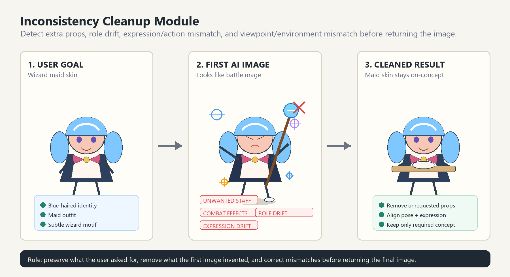
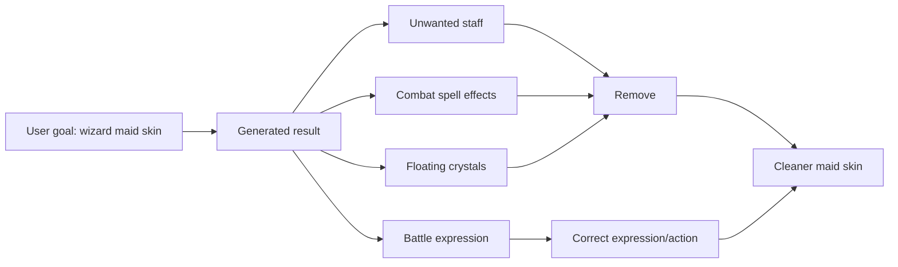

# Visual Case: Inconsistency Cleanup

This example demonstrates the inconsistency-cleanup module.

## User Goal

```text
Generate a maid skin for a blue-haired wizard desktop pet.
```

## Bad First AI Result

The first generated image has these problems:

```text
- The character wears a maid outfit, but a large magic staff was added.
- The character has combat spell effects.
- The expression and pose read as battle-ready, not maid idle/service.
- Floating crystals and extra magic effects compete with the skin design.
```

## Visual Logic Diagram





## Cleanup Diagnosis

```yaml
inconsistency_cleanup:
  prompt_goal: "maid skin for a blue-haired wizard desktop pet"
  must_preserve:
    - blue-haired character identity
    - chibi desktop-pet proportions
    - maid outfit silhouette
    - gentle fantasy color palette
  remove:
    - large magic staff
    - combat spell effects
    - floating crystals
    - weapon-like props
  correct:
    - battle-ready expression -> gentle helpful maid expression
    - staff-gripping hand pose -> relaxed maid idle pose
    - wizard combat read -> maid skin with subtle wizard motif
  keep:
    - subtle star/rune motif only if small and costume-integrated
```

## Copy-Ready Edit Prompt

```text
Edit the character into a clean wizard maid skin. Preserve the blue-haired character identity, chibi desktop-pet proportions, maid outfit, and gentle fantasy color palette. Remove the large magic staff, combat spell effects, floating crystals, and any weapon-like props. Keep only subtle wizard motifs such as a small star hairpin or tiny rune trim on the apron. Change the hands into a relaxed maid idle pose, such as lightly holding the apron or a small tray. Align the expression with a gentle helpful maid mood, not a battle-ready wizard mood. Do not add new weapons, pets, wings, halos, fake text, or extra magical effects.
```

## What Changed In The Skill

- Added `references/inconsistency-cleanup.md`.
- Added inconsistency cleanup trigger language to `SKILL.md`.
- Added inconsistency cleanup to the reference selection matrix.
- Added concrete examples for unwanted props, expression/action mismatch, and viewpoint/environment mismatch.
